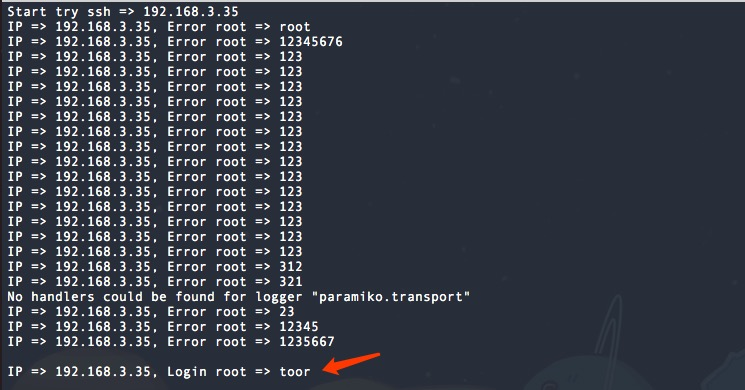

# si1ent脚本
## DDOS防护

提前配置好关于22、3306等对外提供服务端口.
!!!一定先配置好其他端口，以防业务无法正常运行.

### 说明
脚本利用netstat来检测服务连接状态来动态iptables添加.我们知道正常的用户请求,如需修改请自行修改.(效果不是很理想,只能用做简单测试)

```
22端口
iptables -A INPUT -p tcp --dport 22 -j ACCEPT
iptables -A OUTPUT -p tcp --sport 22 -j ACCEPT
```
配置完成后,使用ab模拟用户请求.
```
ab -n 1000 -c 10 http://192.168.3.81/
```
iptables结果  


## 端口状态监测

简单监测端口开放情况,主要适用于内网外网主机端口.
执行结果如下:  


## URL检测
主要检测当前网页内死链接，如果JS内在一些你意想不到的东西呢?


## windows安全检查脚本
此脚本作者"[凌辰's Blog出品](http://www.lcblog.vip/)"
感谢大佬,已收集至git.

## ssh爆破
脚本收集于网络上,出处未知,如有问题还请指出.
ssh爆破脚本默认root账户、端口默认为22加载IP列表、字典列表.

## 查看本地IP
主要查询本地IP信息。

## Pycharm请求到至Burpsuite
脚本在PyCharm中运行py脚本实现代理至Burpsuite

